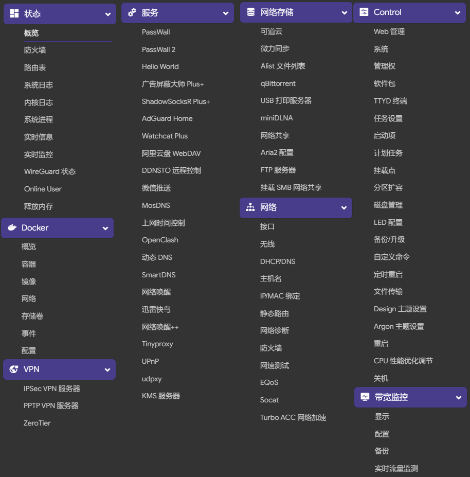

  </a>

 

# 基于[DHDAXCW骷髅头](https://github.com/DHDAXCW?tab=repositories)的R5C固件进行修改

# 下载前请看清发布固件是基于骷髅头还是coolsnowwolf源码进行编译的，两者的eth0/eth1是对调的（不影响WAN/LAN），如果是恢复之前的配置，在网络-接口中可能需要重新配置。
**👉使用本固件前，请严格遵守国家互联网使用相关法律规定,不要违反国家法律规定！👈**

**未经许可不得用于任何商用用途。**

### 固件分类 在[releases](https://github.com/MilesPoupart/NanoPi-R5S-R5C/releases)有备注关键词
- 正式版（含超频）对折腾的，可以选择，电压一定要考虑。超频都是升压的，会造成不稳定的。比如跑cpu测试容易升压等。
- Docker版 含Docker插件，会导致udp转发失效 慎用哦，只要别开passwall的udp，啥都不影响使用！
- 稳定版 含有日常使用插件
- 风扇链接 [点击进入](https://s.click.taobao.com/t?e=m%3D2%26s%3Dd8Ack0Lbx8McQipKwQzePOeEDrYVVa64LKpWJ%2Bin0XJRAdhuF14FMXpyNmcFd6mT8sviUM61dt2T0mcOGN1M6FAj1gqltKaEfKzCcEr0EW0YuhTK3FPxiHMT7yc3NZrQKSOkJV8harV3phaPbavinqGCwVfdcN0wcSpj5qSCmbA%3D)  建议用这种风扇
### 注：不要用恢复备份。。不保证某个插件是否正常运行。。。建议重新设置贼好！

### 源代码地址
- lede https://github.com/DHDAXCW/lede-rockchip
- Luci https://github.com/MilesPoupart/luci
- packages https://github.com/MilesPoupart/packages

### 默认编译

- 用户名：root 密码：password  管理IP：192.168.3.1
- 下载地址： https://github.com/MilesPoupart/NanoPi-R5S-R5C/releases
- 关于r5s刷机方法请参考dn2刷机 https://github.com/DHDAXCW/DoorNet-1-2/blob/mere/emmc.md
- 烧录软件内置提供：rk356x-MiniLoaderAll.bin
- Docker：正式版带docker，有超频，带有docker插件。（对passwall的udp要求很高，不要刷docker版本）
- X86固件 ：[点击链接下载](https://github.com/MilesPoupart/OpenWRT_x86_x64/releases)
- 仅支持MT7921无线网卡
# docker-lite版本插件展示
 
 

# [给骷髅头大佬赏个鸡腿吧](https://afdian.net/@dhdaxcw/plan)
### https://afdian.net/@dhdaxcw/plan

## 鸣谢

特别感谢以下项目：

Openwrt 官方项目：

<https://github.com/openwrt/openwrt>

Lean 大的 Openwrt 项目：

<https://github.com/coolsnowwolf/lede>

immortalwrt 的 OpenWrt 项目：

<https://github.com/immortalwrt/immortalwrt>

P3TERX 大佬的 Actions-OpenWrt 项目：

<https://github.com/P3TERX/Actions-OpenWrt>

SuLingGG 大佬的 Actions 编译框架 项目：

https://github.com/SuLingGG/OpenWrt-Rpi

骷髅头大佬的lede-rockchip项目：

https://github.com/DHDAXCW/lede-rockchip
